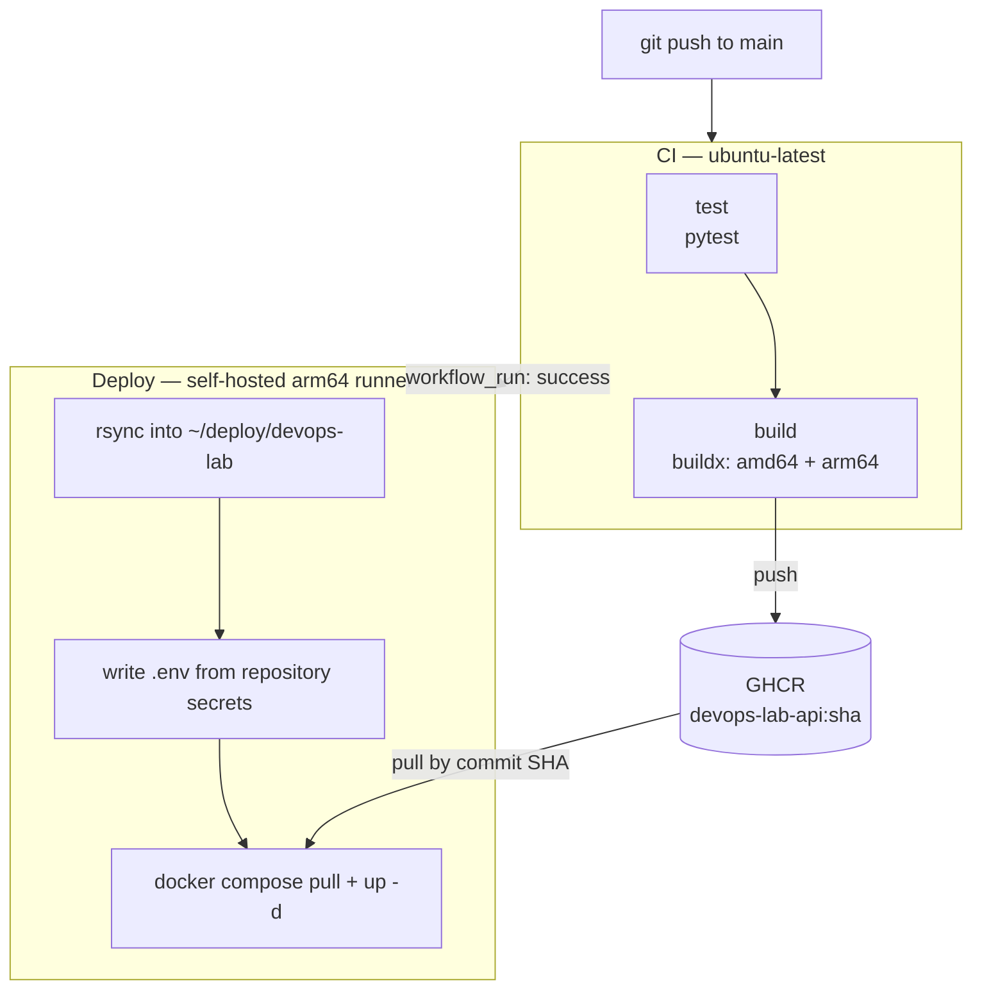
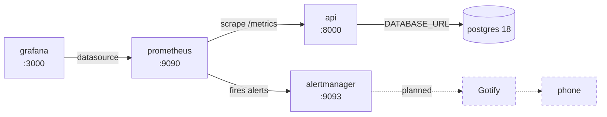
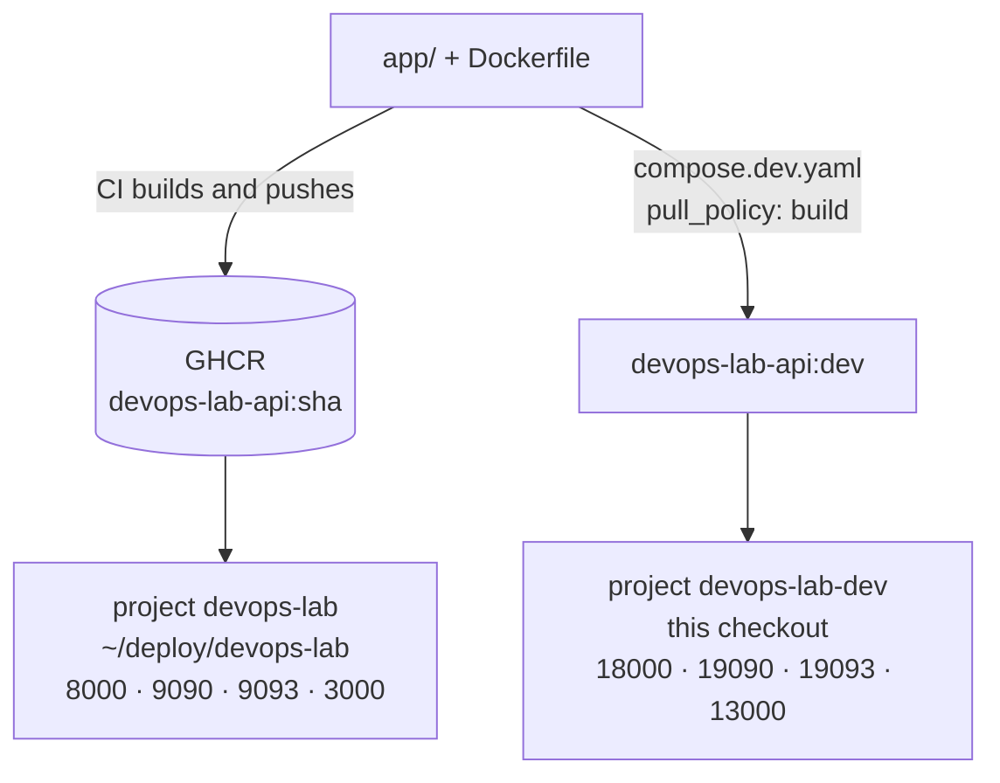

# devops-lab

A self-hosted DevOps lab. The application is deliberately small — a FastAPI service with
three endpoints. Everything interesting happens around it: containerization, CI/CD,
observability, alerting, and later Kubernetes and GitOps.

Runs on an Apple M2 (arm64) under Asahi Linux.

| | |
| --- | --- |
| App | FastAPI, Python 3.14 |
| Database | PostgreSQL 18 |
| Runtime | Docker Compose |
| Registry | GitHub Container Registry |
| CI/CD | GitHub Actions + a self-hosted arm64 runner |
| Observability | Prometheus, Alertmanager, Grafana |

## Pipeline



Deploys always reference the commit SHA tag, never `:latest`.

## Runtime stack



Only `api` is published on the LAN. Prometheus, Alertmanager and Grafana bind to
`127.0.0.1` — the first two have no authentication at all.

## Two isolated stacks

The machine runs the repository twice: this checkout for development, and a deployment
directory fed by the runner. They are separate Compose projects and never share
containers, volumes or networks.



The project name comes from `name:` in [compose.yaml](compose.yaml), overridden locally by
`COMPOSE_PROJECT_NAME` in `.env`. Without that, both directories would resolve to the same
project — they share the basename `devops-lab` — and would overwrite each other's containers.

## Getting started

```bash
cp .env.example .env          # fill in POSTGRES_* and uncomment the dev block
.venv/bin/python -m pytest    # run the tests

# dev stack: builds the API from the working tree
docker compose -f compose.yaml -f compose.dev.yaml up -d
docker compose logs -f api
```

The API is then on <http://localhost:18000>, Grafana on <http://localhost:13000>.

Plain `docker compose up -d` without the overlay pulls the API image from GHCR instead of
building it, and will fail unless Docker is logged in to the registry.

## Dependencies

`requirements.txt` and `requirements-dev.txt` are compiled, not written. Edit the `.in`
file and recompile:

```bash
uv pip compile --universal requirements.in     --output-file=requirements.txt
uv pip compile --universal requirements-dev.in --output-file=requirements-dev.txt
```

Use `--output-file`, not `-o`. Renovate replays the command recorded in the file header
and its parser rejects the short form.

The base image is pinned to a digest and the Python packages are fully pinned, so a commit
SHA determines the image. Renovate keeps both current and opens grouped pull requests.

## Decisions

Structural decisions are recorded in [docs/adr/](docs/adr/) — what was decided, what it
cost, and how the underlying mechanism works.

## Deployment

Pushing to `main` runs CI; a successful CI run triggers the deploy workflow on the
self-hosted runner. The runner never deploys from its own workspace — `actions/checkout`
cleans that directory on every run, which would replace bind-mounted config files and leave
running containers pointing at deleted inodes.

Required repository secrets: `POSTGRES_USER`, `POSTGRES_PASSWORD`, `POSTGRES_DB`.
